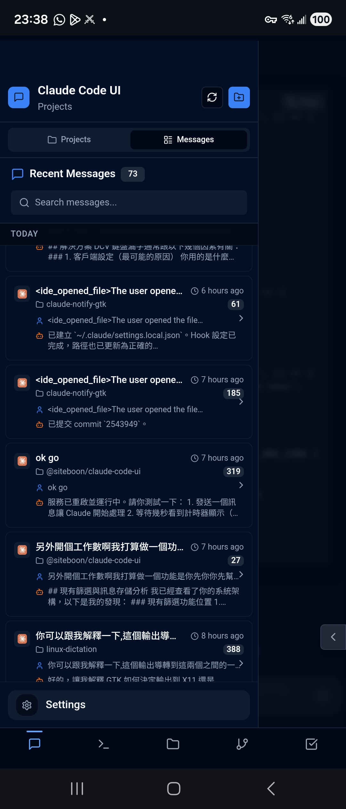

<div align="center">
  
  <h1>Claude Code UI</h1>

  > **Independent Fork** - Maintained with focus on rapid iteration and enhanced developer experience

  Fork of [siteboon/claudecodeui](https://github.com/siteboon/claudecodeui) · [View Upstream](https://github.com/siteboon/claudecodeui)
</div>

---

## Why This Fork?

This is an **independently maintained fork** with a specific vision:

**📱 Multi-Session Management on Mobile** - Monitor and manage multiple Claude Code sessions from your phone or tablet

The core idea: When you're away from your desk, you should be able to:

- **Review Multiple Sessions** - Quickly check progress across different projects
- **Cross-Session Overview** - See what's happening in all your active Claude conversations
- **Mobile Collaboration** - Review, respond, and manage sessions on the go

This fork prioritizes the **multi-session, cross-project experience** optimized for mobile devices.

## What's Different?

### Recent Changes (2024-12-12)

#### ✨ New Features
- **Usage Limits Display** - View your Claude API usage directly in Settings → Tools → Claude. Shows current session usage, weekly limits (all models), and weekly Sonnet-only limits with color-coded progress bars. Data auto-loads when opening Settings and shows "Updated X minutes ago" timestamp.

#### 📱 UX Improvements
- **Session switching feedback** - Loading overlay with spinner appears when switching between sessions for better visual feedback
- **Left-handed mode** - New option in Settings → Appearance to swap send and image upload button positions for left-handed users on mobile
- **Floating sidebar button** - Draggable floating button on mobile for quick sidebar access

### Previous Changes (2024-12-11)

#### 🔧 Multi-Session Stability
- **Fixed message cross-contamination** - Messages no longer jump between sessions when multiple projects are active
- **Improved session switching** - Can now switch sessions freely even while one is processing
- **Network-first PWA caching** - Service Worker updated to always fetch latest version, fixing stale cache issues on mobile

#### ✨ New Features
- **Messages View** - New chronological view that displays all conversations across projects sorted by time. See the last few messages from each session at a glance. Toggle between Projects and Messages views in the sidebar.
- **About page with build info** - Settings → About now shows build timestamp for easy version verification
- **Scrollable Settings tabs** - Tab navigation is now scrollable on mobile devices

### Planned Improvements
- 🔄 **Cross-Session Workflow** - Better navigation between multiple active sessions
- 📊 **Session Overview** - Quick status checks across projects from mobile
- 📱 **Mobile-Optimized Management** - Manage multiple Claude sessions from anywhere

> **Note**: This fork prioritizes multi-session management and mobile experience. Development direction may diverge from upstream.

---

## About This Project

A desktop and mobile UI for [Claude Code](https://docs.anthropic.com/en/docs/claude-code) and [Cursor CLI](https://docs.cursor.com/en/cli/overview). View your active projects and sessions from everywhere (mobile or desktop).

## Screenshots

<div align="center">

<table>
<tr>
<td align="center">
<h3>Desktop View</h3>

<br>
<em>Main interface showing project overview and chat</em>
</td>
<td align="center">
<h3>Mobile Experience</h3>

<br>
<em>Responsive mobile design with touch navigation</em>
</td>
</tr>
<tr>
<td align="center" colspan="2">
<h3>Messages View</h3>

<br>
<em>Chronological view of all conversations across projects</em>
</td>
</tr>
<tr>
<td align="center" colspan="2">
<h3>CLI Selection</h3>

<br>
<em>Select between Claude Code and Cursor CLI</em>
</td>
</tr>
</table>

</div>

## Features

- **Responsive Design** - Works seamlessly across desktop, tablet, and mobile
- **Interactive Chat Interface** - Built-in chat for Claude Code or Cursor
- **Messages View** - Chronological view of all conversations across projects with message previews
- **Integrated Shell Terminal** - Direct CLI access with web link support
- **File Explorer** - Interactive file tree with syntax highlighting and live editing
- **Git Explorer** - View, stage, commit changes, and switch branches
- **Session Management** - Resume conversations, manage multiple sessions
- **TaskMaster AI Integration** *(Optional)* - Advanced project management

## Quick Start

### Prerequisites

- [Node.js](https://nodejs.org/) v20 or higher
- [Claude Code CLI](https://docs.anthropic.com/en/docs/claude-code) and/or [Cursor CLI](https://docs.cursor.com/en/cli/overview) installed and configured

### Installation

**Clone and run locally:**

```bash
git clone https://github.com/hkk2018/claudecodeui.git
cd claudecodeui
npm install
npm run dev
```

The application will start at `http://localhost:3001` by default.

**Custom Port Configuration:**

You can customize the port using command line arguments or environment variables:

```bash
# Using command line argument (recommended)
node server/index.js --port=9001

# Using environment variable
PORT=9001 npm run start

# Priority: --port argument > PORT env variable > 3001 (default)
```

### Alternative: Run from NPM (Upstream Version)

If you prefer the stable upstream version:

```bash
npx @siteboon/claude-code-ui
```

## Development

```bash
# Development mode (with hot reload)
npm run dev

# Build for production
npm run build

# Start production server
npm run start
```

## Security & Tools Configuration

**🔒 Important**: All Claude Code tools are **disabled by default**. Enable only what you need:

1. Open Tools Settings (gear icon in sidebar)
2. Enable selectively
3. Apply settings

<div align="center">


*Tools Settings interface - enable only what you need*

</div>

## Architecture Highlights

This project demonstrates practical implementations of:

- **React 18** with modern hooks patterns
- **WebSocket** real-time communication with state management
- **CLI Integration** via Node.js process spawning
- **CodeMirror** integration for advanced code editing
- **Express.js** RESTful API with file system access
- **Session Persistence** via JSONL parsing

### System Overview

```
┌─────────────────┐    ┌─────────────────┐    ┌─────────────────┐
│   Frontend      │    │   Backend       │    │  Claude CLI     │
│   (React/Vite)  │◄──►│ (Express/WS)    │◄──►│  Integration    │
└─────────────────┘    └─────────────────┘    └─────────────────┘
```

### Tech Stack

**Frontend:**
- React 18, Vite, Tailwind CSS
- CodeMirror, xterm.js
- WebSocket client

**Backend:**
- Node.js, Express
- WebSocket server (ws)
- SQLite (better-sqlite3)
- CLI integration (node-pty, cross-spawn)

## Collaboration

This project is open for:

- 💡 Feature suggestions and discussions
- 🐛 Bug reports and fixes
- 🔧 Performance improvements
- 📚 Documentation enhancements

Feel free to open issues or submit pull requests. While this is primarily a personal fork, valuable contributions are always welcome.

## Upstream Sync

This fork occasionally syncs with upstream for critical updates but maintains independent development. To check upstream changes:

```bash
git remote add upstream https://github.com/siteboon/claudecodeui.git
git fetch upstream
git log upstream/main --oneline
```

## License

GNU General Public License v3.0 - see [LICENSE](LICENSE) file for details.

This project inherits the GPL v3 license from the upstream project and remains free and open source.

## Acknowledgments

### Based On

- **[Claude Code UI](https://github.com/siteboon/claudecodeui)** by [Siteboon](https://github.com/siteboon) - Original project
- All upstream contributors

### Built With

- **[Claude Code](https://docs.anthropic.com/en/docs/claude-code)** - Anthropic's official CLI
- **[Cursor CLI](https://docs.cursor.com/en/cli/overview)** - Cursor's command-line interface
- **[React](https://react.dev/)** - User interface library
- **[Vite](https://vitejs.dev/)** - Build tool and dev server
- **[Tailwind CSS](https://tailwindcss.com/)** - Utility-first CSS
- **[CodeMirror](https://codemirror.net/)** - Code editor component
- **[xterm.js](https://xtermjs.org/)** - Terminal component

---

<div align="center">
  <strong>Independently maintained fork for rapid experimentation and learning.</strong>
  <br>
  <sub>Original project: <a href="https://github.com/siteboon/claudecodeui">siteboon/claudecodeui</a></sub>
</div>
